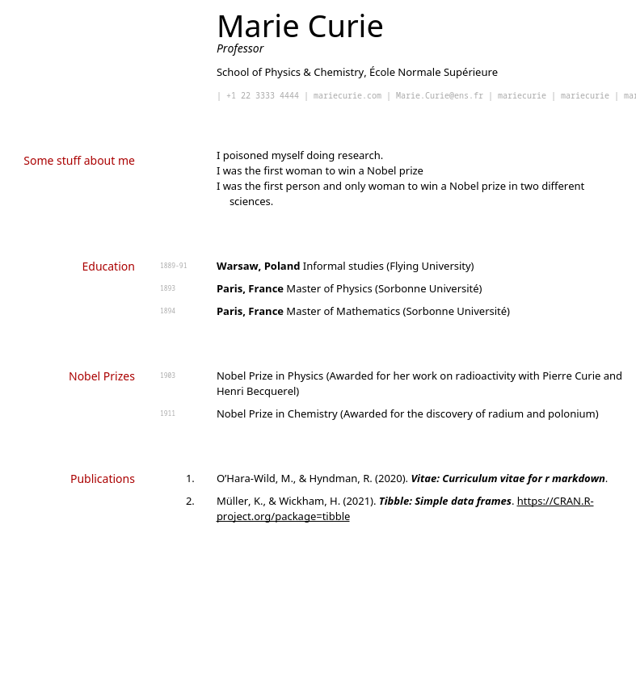
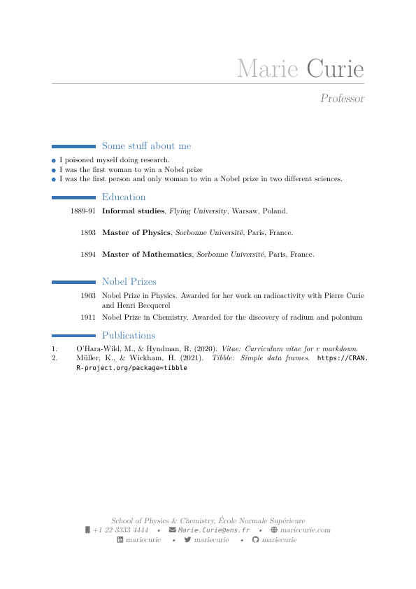

# vitae 

*/ˈviːteɪ/*

<!-- badges: start -->

[](https://cran.r-project.org/package=vitae)
[](https://github.com/mitchelloharawild/vitae/actions/workflows/R-CMD-check.yaml)
[](https://lifecycle.r-lib.org/articles/stages.html#maturing)
[](https://cran.r-project.org/package=vitae)
<!-- badges: end -->

## Templates and tools for making a Résumé/CV

The *vitae* package makes creating and maintaining a Résumé or CV with R
Markdown simple. It provides a collection of LaTeX and HTML templates,
with helpful functions to add content to the documents.

## Installation

You can install the **release** version from CRAN.

``` r
install.packages('vitae')
```

You can install the **development** version from
[GitHub](https://github.com/mitchelloharawild/vitae).

``` r
# install.packages("remotes")
remotes::install_github("mitchelloharawild/vitae")
```

This package requires LaTeX to be installed on your computer. If you’re
encountering issues, please check that LaTeX is installed. The [tinytex
package](https://github.com/rstudio/tinytex) makes it easy to setup
LaTeX within R:

``` r
install.packages('tinytex')
tinytex::install_tinytex()
```

## Getting started

The *vitae* package currently supports 6 popular CV templates. You can
see some previews of the available templates [below](#templates).

If you prefer a guided introduction in video form, check out [Bryan
Jenks](https://github.com/tallguyjenks)’
[freeCodeCamp](https://github.com/freeCodeCamp/freeCodeCamp) [tech
talk](https://youtu.be/cMlRAiQUdD8):

[](https://youtu.be/cMlRAiQUdD8)

Creating a new CV with `vitae` can be done using the RStudio R Markdown
template selector:


These templates leverage the strength of rmarkdown to include common
information in the YAML header (name, position, social links…) and
extended information in the main body. The main body of the CV is
written using markdown, and allows for data-driven generation of entries
using the [`*_entries`
functions](https://pkg.mitchelloharawild.com/vitae/reference/cv_entries.html).
This allows you to import your working history from other sources (such
as ORCID, Google Scholar, or a maintained dataset), and include them
programmatically into your CV.

## Templates

There are currently 6 templates available in this package:

| [**vitae::awesomecv**](https://pkg.mitchelloharawild.com/vitae/reference/awesomecv.html)                                                        | [**vitae::hyndman**](https://pkg.mitchelloharawild.com/vitae/reference/hyndman.html)                                                      |
|-------------------------------------------------------------------------------------------------------------------------------------------------|-------------------------------------------------------------------------------------------------------------------------------------------|
| [](https://pkg.mitchelloharawild.com/vitae/reference/awesomecv.html) | [](https://pkg.mitchelloharawild.com/vitae/reference/hyndman.html) |

| [**vitae::latexcv**](https://pkg.mitchelloharawild.com/vitae/reference/latexcv.html)                                                      | [**vitae::markdowncv**](https://pkg.mitchelloharawild.com/vitae/reference/markdowncv.html)                                                         |
|-------------------------------------------------------------------------------------------------------------------------------------------|----------------------------------------------------------------------------------------------------------------------------------------------------|
| [](https://pkg.mitchelloharawild.com/vitae/reference/latexcv.html) | [](https://pkg.mitchelloharawild.com/vitae/reference/markdowncv.html) |

| [**vitae::moderncv**](https://pkg.mitchelloharawild.com/vitae/reference/moderncv.html)                                                       | [**vitae::twentyseconds**](https://pkg.mitchelloharawild.com/vitae/reference/twentyseconds.html)                                                            |
|----------------------------------------------------------------------------------------------------------------------------------------------|-------------------------------------------------------------------------------------------------------------------------------------------------------------|
| [](https://pkg.mitchelloharawild.com/vitae/reference/moderncv.html) | [](https://pkg.mitchelloharawild.com/vitae/reference/twentyseconds.html) |

Extending the package to add new templates is a somewhat simple process
(details in the [creating vitae
templates](https://pkg.mitchelloharawild.com/vitae/articles/extending.html)
vignette).

## Examples of using vitae

- [Mitchell O’Hara-Wild](https://github.com/mitchelloharawild/CV)
- [Rob Hyndman](https://github.com/robjhyndman/CV)
- [Eric R. Scott](https://github.com/Aariq/curriculum-vitae)
- [Nat Price](https://github.com/natbprice/cv)
- [Sam Abbott](https://github.com/seabbs/cv) (automatic deployment!)
- [JooYoung Seo](https://github.com/jooyoungseo/jy_CV) (printing
  multiple bibliographic entries according to a given csl file)
- [Diogo M. Camacho](https://github.com/diogocamacho/CV)
- [Han Zhang](https://github.com/HanZhang-psych/CV) (custom csl files)
- [Bryan Jenks](https://github.com/tallguyjenks/CV)
- [Lorena Abad](https://github.com/loreabad6/R-CV)
- [Lampros Sp. Mouselimis](https://github.com/mlampros/My.CVitae) (using
  Github Actions and a docker image to programmatically generate the CV
  file)
- [Adam Kirosingh](https://github.com/akirosingh/CV)
- [Marco Lombardi](https://github.com/mlombardi6/awesome-template)
- [Anthony Romero](https://github.com/ganthonyr/CV)
- [André Calero Valdez](https://github.com/sumidu/acv) This version uses
  a database to manage the content and automatically updates the content
  once a week using Github actions. PDF is then added as a release after
  rendering. Also uses a forked version of the package to remove the
  trailing dot in brief entries.

Add your vitae to the list using a PR.

------------------------------------------------------------------------

Please note that the ‘vitae’ project is released with a [Contributor
Code of
Conduct](https://github.com/mitchelloharawild/vitae/blob/master/.github/CODE_OF_CONDUCT.md).
By contributing to this project, you agree to abide by its terms.

The vitae project began as at [rOpenSci](https://ropensci.org/)’s
[OzUnconf 2018](https://ozunconf18.ropensci.org/). A big thank you to
rOpenSci and the event organisers for their work, which has played a big
role in the formation of this package.
